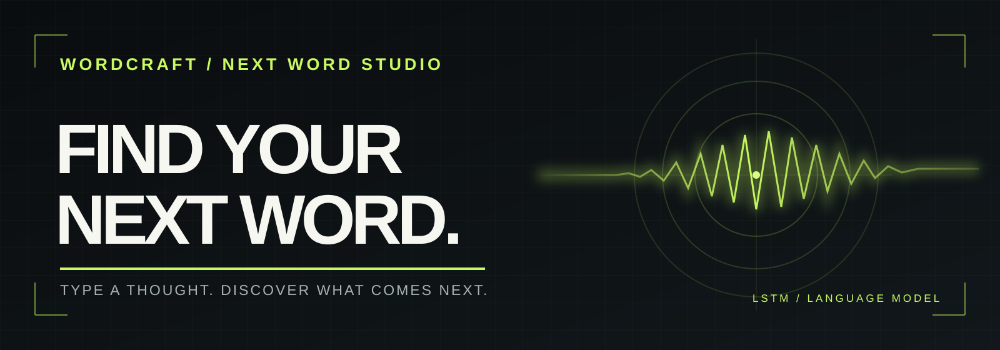
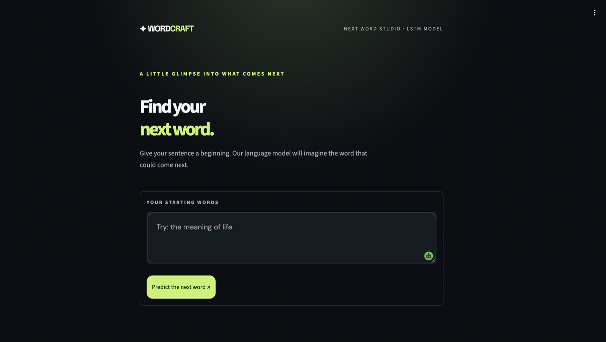

<div align="center">



# WordCraft

### A little glimpse into what comes next.

Type the beginning of a sentence. WordCraft uses a trained LSTM language model to suggest the next word and two alternatives.

[](https://wordcraft-next-word-predictor.onrender.com/)


</div>

---

## See WordCraft



*The live app: enter a phrase, then choose “Predict the next word.”*

## See the idea

> **Your words** → “the meaning of life”
>
> **WordCraft** → one suggested next word, plus two other possibilities

Try a phrase in the [live app](https://wordcraft-next-word-predictor.onrender.com/) to see its actual predictions.

## What WordCraft does

- **Next word prediction** — shows the model's highest-scoring recognized word.
- **Three possibilities** — presents two alternative suggestions alongside the top result.
- **Ready to run** — the trained model, tokenizer, and sequence length are included.
- **Focused interface** — a single text box and clear result card built with Streamlit.

Predictions reflect the model's training data and vocabulary. They may be imperfect; a prompt with no recognized words produces no suggestion.

## How it works

```text
Your sentence
     ↓
Tokenizer → padded word sequence → LSTM model
                                        ↓
                              next-word probabilities
                                        ↓
                              top three known words
```

The app lowercases the prompt, tokenizes it, pads the sequence to the model's expected length, and ranks the model's output. See [`app.py`](app.py) for the inference code.

## Technology

| Layer | Tools |
| --- | --- |
| Interface | Streamlit |
| Language model | TensorFlow / Keras LSTM |
| Inference | NumPy, tokenizer, saved model |
| Container | Docker with Python 3.12 |
| Deployment | Render |

## Run locally

Install **Python 3.12**, then run:

```bash
git clone https://github.com/prithvicoder1/WordCraft-Next-Word-Predictor.git
cd WordCraft-Next-Word-Predictor
python -m pip install -r requirements.txt
python -m streamlit run app.py
```

Open the address printed by Streamlit, usually [http://localhost:8501](http://localhost:8501).

## Run with Docker

```bash
docker build -f docker/Dockerfile -t wordcraft .
docker run --rm -p 8501:8501 wordcraft
```

Open [http://localhost:8501](http://localhost:8501). If port 8501 is busy, run with `-p 18501:8501` and open [http://localhost:18501](http://localhost:18501).

## Project files

| File | Purpose |
| --- | --- |
| [`app.py`](app.py) | Streamlit interface and next-word inference |
| `lstm_model (1).h5`, `tokenizer.pkl`, `max_len.pkl` | Model and preprocessing files used by the app |
| [`codefile.ipynb`](codefile.ipynb) | LSTM training notebook |
| [`RNNimplementation.ipynb`](RNNimplementation.ipynb) | Separate RNN exploration |
| [`qoute_dataset.csv`](qoute_dataset.csv) | Included quote dataset |
| [`docker/Dockerfile`](docker/Dockerfile) | Container configuration |

Keep the model and preprocessing files in the repository root beside `app.py` when running locally.

## Deploy on Render

Create a **Web Service** from this repository using **Docker**. Set the Dockerfile path to `docker/Dockerfile` and the health check path to `/_stcore/health`. The container uses Render's `PORT` when available.
